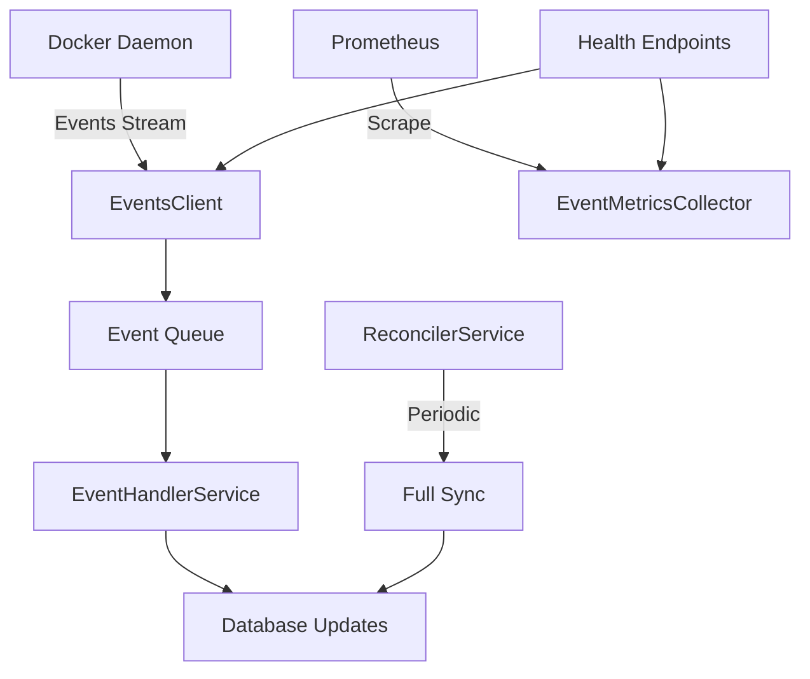

# Docker Events Integration

This document describes the Docker events integration system that keeps volumes and attachments fresh in near real-time.

## Overview

The Docker events system listens to the Docker daemon for volume and container lifecycle events, automatically updating the database to maintain consistency between Docker's state and the application's database.

## Features

### Core Functionality
- **Real-time Event Processing**: Streams Docker events for volumes (create/remove) and containers (start/stop/die/destroy)
- **Automatic Reconnection**: Handles Docker daemon restarts with exponential backoff and jitter
- **Event Queue**: Bounded channel processing with configurable queue size and overflow handling
- **Idempotent Operations**: Safe to replay events without data corruption
- **Reconciliation**: Periodic full sync to catch any missed events
- **Health Monitoring**: Integration with `/health` endpoints and Prometheus metrics

### Event Types Supported
- `volume.create` - Volume creation
- `volume.remove` - Volume removal  
- `container.start` - Container started
- `container.stop` - Container stopped
- `container.die` - Container died/exited
- `container.destroy` - Container removed

## Configuration

The events system is configured using environment variables:

### Environment Variables

```bash
# Enable/disable Docker events integration
EVENTS_ENABLED=true

# Event queue configuration
EVENTS_QUEUE_SIZE=1000

# Reconnection backoff settings
EVENTS_BACKOFF_MIN_DURATION=1s
EVENTS_BACKOFF_MAX_DURATION=5m

# Periodic reconciliation interval
EVENTS_RECONCILE_INTERVAL=30m
```

### Configuration Details

| Variable | Type | Default | Description |
|----------|------|---------|-------------|
| `EVENTS_ENABLED` | boolean | `false` | Enable/disable the entire events system |
| `EVENTS_QUEUE_SIZE` | int | `1000` | Size of the internal event processing queue |
| `EVENTS_BACKOFF_MIN_DURATION` | duration | `1s` | Minimum backoff time between reconnection attempts |
| `EVENTS_BACKOFF_MAX_DURATION` | duration | `5m` | Maximum backoff time between reconnection attempts |
| `EVENTS_RECONCILE_INTERVAL` | duration | `30m` | Interval for full reconciliation runs (0 = disabled) |

### Example Configuration

```bash
# Production settings
EVENTS_ENABLED=true
EVENTS_QUEUE_SIZE=2000
EVENTS_BACKOFF_MIN_DURATION=2s
EVENTS_BACKOFF_MAX_DURATION=10m
EVENTS_RECONCILE_INTERVAL=1h

# Development settings  
EVENTS_ENABLED=true
EVENTS_QUEUE_SIZE=100
EVENTS_BACKOFF_MIN_DURATION=1s
EVENTS_BACKOFF_MAX_DURATION=30s
EVENTS_RECONCILE_INTERVAL=5m

# Disable events completely
EVENTS_ENABLED=false
```

## Health Monitoring

### Health Endpoints

The events system integrates with the application's health endpoints:

#### General Health: `GET /api/v1/health`
Includes events status in the overall health response:

```json
{
  "status": "healthy",
  "timestamp": 1640995200,
  "checks": {
    "docker": {"status": "healthy"},
    "database": {"status": "healthy"},
    "events": {
      "status": "healthy",
      "connected": true,
      "queue_size": 0,
      "processed_total": 1250,
      "errors_total": 2,
      "dropped_total": 0,
      "reconnects_total": 1,
      "last_event_timestamp": 1640995180,
      "last_event_age_seconds": 20,
      "reconciliation_runs": {
        "full": 5,
        "volumes": 12, 
        "containers": 12
      }
    }
  }
}
```

#### Events-Specific Health: `GET /api/v1/health/events`
Detailed events system status:

```json
{
  "status": "healthy",
  "connected": true,
  "queue_size": 0,
  "processed_total": 1250,
  "errors_total": 2,
  "dropped_total": 0,
  "reconnects_total": 1,
  "last_event_timestamp": 1640995180,
  "last_event_age_seconds": 20,
  "last_reconnect_timestamp": 1640994800,
  "reconciliation_runs": {
    "full": 5,
    "volumes": 12,
    "containers": 12
  }
}
```

### Status Values

- **healthy**: Events system is connected and processing events normally
- **degraded**: Connected but no events received for 5+ minutes
- **unhealthy**: Not connected to Docker events stream
- **not_configured**: Events system is disabled

## Prometheus Metrics

The events system exposes comprehensive Prometheus metrics for monitoring:

### Event Processing Metrics
- `volumeviz_events_docker_events_processed_total{event_type, action}` - Total processed events by type
- `volumeviz_events_docker_events_failed_total{error_type, event_type}` - Failed event processing attempts  
- `volumeviz_events_docker_events_dropped_total` - Events dropped due to queue overflow
- `volumeviz_events_docker_events_queue_size` - Current event queue size

### Connection Metrics
- `volumeviz_events_docker_events_connection_status` - Connection status (1=connected, 0=disconnected)
- `volumeviz_events_docker_events_reconnects_total` - Total reconnection attempts
- `volumeviz_events_docker_events_stream_duration_seconds` - Duration of event stream connections
- `volumeviz_events_docker_events_last_event_timestamp` - Timestamp of last processed event

### Reconciliation Metrics
- `volumeviz_events_docker_reconciliation_runs_total{reconciliation_type}` - Reconciliation runs by type
- `volumeviz_events_docker_reconciliation_duration_seconds{reconciliation_type}` - Reconciliation duration
- `volumeviz_events_docker_reconciliation_failures_total{reconciliation_type, error_type}` - Failed reconciliations

### Resource Sync Metrics
- `volumeviz_events_docker_volumes_synced_total{operation, source}` - Volume sync operations
- `volumeviz_events_docker_containers_synced_total{operation, source}` - Container sync operations
- `volumeviz_events_docker_mounts_synced_total{operation, source}` - Volume mount sync operations
- `volumeviz_events_docker_resources_removed_total{resource_type, source}` - Removed resources

## Architecture

### Components

1. **EventsClient**: Manages Docker events streaming with automatic reconnection
2. **EventHandlerService**: Processes individual events and updates the database
3. **ReconcilerService**: Performs periodic reconciliation to catch missed events
4. **EventMetricsCollector**: Collects and exposes Prometheus metrics
5. **Repository Interface**: Abstracts database operations for testability

### Event Flow



### Error Handling

- **Connection Failures**: Automatic reconnection with exponential backoff
- **Processing Errors**: Logged and counted in metrics, event discarded
- **Queue Overflow**: Events dropped with metric tracking
- **Database Errors**: Logged and counted, operation retried on next reconciliation

## Testing

### Unit Tests
Run unit tests with:
```bash
go test ./internal/events/... -v
```

### Integration Tests
Run integration tests (requires Docker daemon):
```bash
go test ./internal/events/... -run TestEventsIntegration -v
```

Skip integration tests:
```bash
go test ./internal/events/... -short
```

### Test Coverage
The test suite covers:
- Event type mapping and parsing
- Event handler logic for all event types  
- Connection management and backoff
- Metrics collection
- End-to-end Docker integration scenarios
- Reconciliation logic

## Deployment Considerations

### Production Settings
```bash
EVENTS_ENABLED=true
EVENTS_QUEUE_SIZE=5000
EVENTS_BACKOFF_MIN_DURATION=5s
EVENTS_BACKOFF_MAX_DURATION=30m
EVENTS_RECONCILE_INTERVAL=2h
```

### Monitoring Alerts
Set up alerts for:
- Events connection status down for > 5 minutes
- High error rates (> 5% of events failing)
- Queue overflow (dropped events > 0)
- Reconciliation failures
- No events received for > 10 minutes (during active Docker usage)

### Resource Usage
- Memory: ~10-50MB depending on event volume and queue size
- CPU: Minimal, event-driven processing
- Network: Low, only Docker daemon communication
- Disk: None, all state in memory

## Troubleshooting

### Common Issues

**Events not processing**
- Check `EVENTS_ENABLED=true`
- Verify Docker daemon is running and accessible
- Check `/health/events` endpoint for connection status
- Review application logs for connection errors

**High reconnection count**  
- Docker daemon instability
- Network issues between app and Docker
- Check Docker daemon logs
- Consider increasing backoff durations

**Missed events**
- Check for dropped events in metrics
- Increase `EVENTS_QUEUE_SIZE` if queue overflows
- Reduce `EVENTS_RECONCILE_INTERVAL` for faster catch-up
- Monitor processing latency

**Database inconsistencies**
- Run manual reconciliation via health endpoints
- Check database constraints and cascades
- Review reconciliation failure metrics
- Verify idempotent operation logic

### Debug Mode
Enable verbose logging:
```bash
LOG_LEVEL=debug
```

This will show detailed event processing information in the application logs.